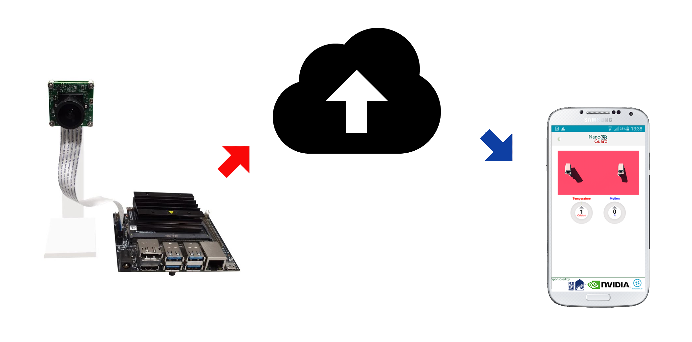

# Jetson Nano surveillance apps

The objective of this project is to detect the motion and notify the user about this motion. This system is helpful for monitoring the home, shop or other properties. For detecting the motion we used a motion detection algorithm. The algorithm is implemented in python along with OpenCV. The whole system was implemented in Jetson Nano.

A mobile application was used for visualizing the motion information. The mobile application also notified user based on motion information.

The block diagram of the system is given below: 

## Jetson Nano surveillance apps
![[Watch the video]](https://www.youtube.com/watch?v=WoeEEPih42Y)
## Details Description of the Project
link: www.roboticsbangladesh.com